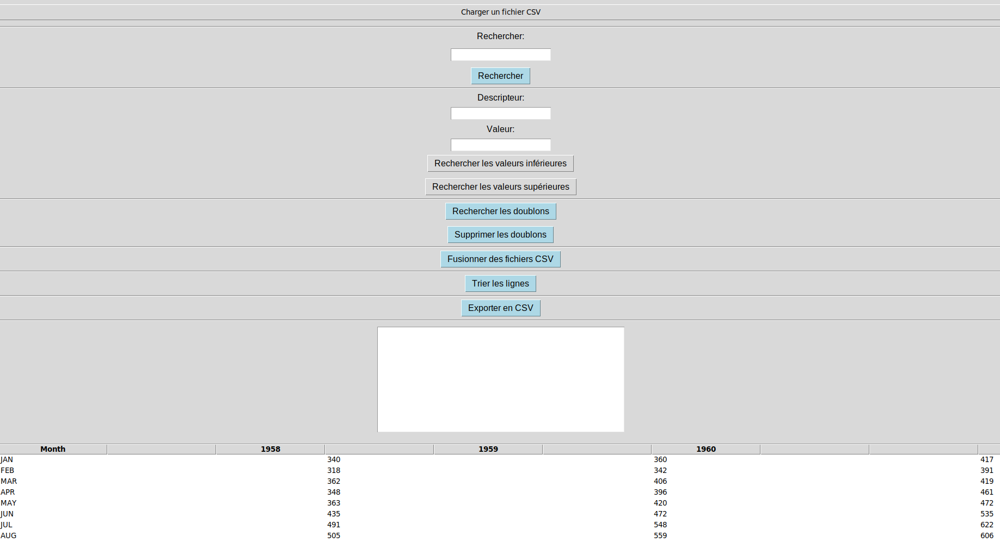

# 📂 Application de traitement de fichiers CSV avec Tkinter 👩‍💻

Application de traitement de fichiers CSV est un projet en Python qui utilise la bibliothèque Tkinter pour créer une interface utilisateur permettant de charger, visualiser et manipuler des fichiers CSV.

1. Chargez un fichier avec le premier bouton
2. Profitez des fonctionnalités
3. Les résultats sont affichés dans le champ de texte
4. Les modifications sur le fichier CSV sont visibles directement sur l'interface graphique

 ## 🚀 Fonctionnalités

- Chargement d'un fichier CSV
- Affichage du contenu du fichier dans un tableau esthétique
- Recherche de valeurs dans le fichier CSV
- Recherche de doublons dans le fichier CSV
- Fusion de fichiers CSV
- Tri des lignes du fichier CSV
- Exportation du tableau au format CSV

### Explication du code

L'application de traitement de fichiers CSV avec Tkinter est conçue en utilisant la bibliothèque Tkinter de Python pour créer une interface utilisateur graphique. Voici une explication technique du fonctionnement global du code :

1.    Importation des modules : Les modules nécessaires pour le fonctionnement de l'application sont importés, tels que `tkinter`, `csv`, `filedialog` et `ttk`.

2.    Création de la fenêtre principale : Une fenêtre principale est créée en utilisant la classe `Tk()` de Tkinter. C'est la fenêtre de l'application où tous les widgets seront affichés.

3.    Définition des fonctions : Les différentes fonctionnalités de l'application sont implémentées sous forme de fonctions. Cela inclut la fonction de chargement du fichier CSV, la création du tableau de données, les fonctions de recherche, de recherche de doublons, de fusion de fichiers CSV, de tri et d'exportation du tableau.

4.    Création des widgets : Les différents widgets tels que les boutons, les labels, les champs de texte et les treeviews sont créés en utilisant les classes appropriées de Tkinter, tels que `Button`, `Label`, `Entry` et `Treeview`. Les widgets sont positionnés dans la fenêtre principale en utilisant les méthodes de positionnement, comme `pack()` ou `grid()`.

5.    Configuration des widgets : Les widgets sont configurés en utilisant les méthodes appropriées pour définir leurs propriétés, telles que le texte des boutons, la police des labels, les commandes des boutons, etc.

6.    Liaison des fonctions aux widgets : Les fonctions implémentées sont liées aux widgets correspondants en utilisant les commandes des boutons ou les événements appropriés, tels que `command=` pour les boutons ou `bind()` pour les champs de texte.

7.    Exécution de la boucle principale : La boucle principale de l'application est exécutée en appelant la méthode `mainloop()` de la fenêtre principale. Cela permet à l'application de répondre aux événements utilisateur et de maintenir l'interface utilisateur active.

